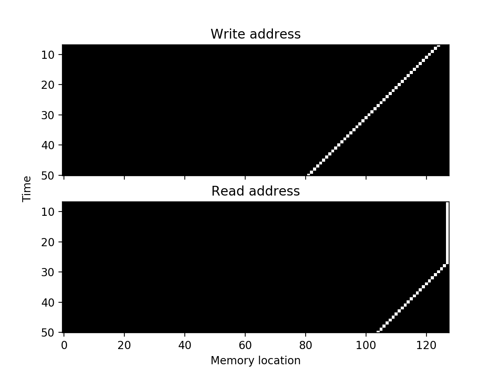

# Linear Logic and Recurrent Neural Networks

This is the repository of the paper "Linear Logic and Recurrent Neural Networks" and the associated TensorFlow implementation. At the moment the repo is private. The aim is to find a sequence-to-sequence task on which the Pattern NTM substantially outperforms the NTM. A good overview of attention and augmented RNNs is [this paper](http://distill.pub/2016/augmented-rnns/) by Chris Olah and Shan Carter.

The **models** that have been implemented so far are

- The ordinary NTM (see class `NTM` in `ntm.py`).
- The pattern NTM (see class `PatternNTM` in `ntm.py`) which is the model described in Section 4.1 of the paper.
- The alternative pattern NTM (see class `PatternNTM_alt` in `ntm.py`) which is the pattern NTM but with the controller allowed to manipulate the read address of the first memory ring directly.

The **tasks** that have been implemented are

- Copy task (as in the NTM paper),
- Repeat copy task (as in the NTM paper),
- Pattern task (defined in Section 4.1 of our paper).

The actual training and testing is done through the Python notebook `ntm/work.ipynb`. The results of experiments are posted on the [spreadsheet](https://docs.google.com/spreadsheets/d/1s7kOUL3OI9Ps4MTPLclvXZ_wRJnrwxyxIiqFqZZDspY/edit?usp=sharing) (the old version of the spreadsheet is [here](https://docs.google.com/spreadsheets/d/1GqwW3ma7Cd1W8X8Txph9MPmLSkQ0C-i0tP0YHeINzMs/edit?usp=sharing)). There are HTML records of some of the Jupyter sessions, including visualisations of the read and write addresses in the folder `/doc`. **Note:** it is probably a good idea for each contributor to maintain their own Jupyter workbook, but share the same `ntm/ntm.py`.

## History

It seems worth recording some of the decisions that led to the current version of the code, since these decisions reflect the structure of the underlying problem in a way that may not be very well captured by the final result, and this structure is worth remembering. The development has been (somewhat artificially) divided into major versions, as follows. Each major version is memorialised in a Jupyter notebook, e.g. `work-v2.ipynb`.

- **Version 1** (snapshot `12-3-2017`). The aim at this point was to get the models running and converging to a reasonably low error on the Copy, Repeat Copy and Pattern tasks. No attention was paid to generalisation (which here means training on shorter sequences and testing on longer ones). This was successful, and the results are recorded on the [spreadsheet](https://docs.google.com/spreadsheets/d/1GqwW3ma7Cd1W8X8Txph9MPmLSkQ0C-i0tP0YHeINzMs/edit?usp=sharing). However there were bad choices for the weight initialisations, some mistaken activation functions, and other oversights, all of which meant that `v1` completely failed to generalise. 

- **Version 2** (snapshot `18-3-2017`). This version implemented sharpening, added initial and terminal symbols, fixed the nonlinearities on the add and erase vectors (which were softmax before!), fixed a bug in the calculation of the cross-entropy which led to `NaN`s. These changes were only implemented for the NTM. These changes led to the model both converging to low error and actually using multiple memory locations (one typical run is captured in `doc/work-v2.html`). However, the failure to generalise persists.

- **Version 3** (snapshot `19-3-2017`). Implemented training on sequences of varying length (the length is constant within a batch) by [masking the cross-entropy](https://danijar.com/variable-sequence-lengths-in-tensorflow/). Preliminary experiments suggest that this leads to both convergence *and* very good generalisation of the NTM on the Copy task. The memory focus is sharp and we see read and write address patterns similar to those in the NTM paper. Some example runs are `doc/work-v3-1.html, doc/work-v3-2.html, doc/work-v3-3.html`. The read and write address over the course of the input/output of one sequence from `doc/work-v3-3.html` is shown here:



The horizontal axis is the position in memory, the vertical axis is the time. This was generated with the hyperparameters `N = 30` (so sequences of length `30`, including the initial and terminal symbol), `num_classes = 10` (so there are `8` content symbols plus the initial and terminal symbols), `epoch = 100`, with a controller state size `100`, memory address space of dimension `128` and content space of dimension `20`. The generalisation to sequences of length `N = 60` was *perfect* (i.e. all `0.0`). Moreover these properties are all "statistically" robust, in the sense that almost every time we train the network with these hyperparameters, the results are this good.

- **Version 4** (snapshot `26-3-2017`). The Pattern NTM has been updated to include sharpening, and the Jupyter notebook now has sensible initialisation for it as well. The Copy, Repeat Copy and Pattern tasks are all implemented. The visualisations were extended to include the second memory ring of the Pattern NTM, and a graph of the mean error during training. Currently the NTM performs well on all tasks (Copy, Repeat Copy, Pattern). The Pattern NTM, as described in the paper, is completely broken, but it seems to work when we add an *interpolation* between the NTM controlling the read address of the first memory ring directly (as in the standard NTM) and the NTM controlling this address only indirectly through the second memory ring (as in the paper version of the Pattern NTM).

- **Version 5** (*current version*)...

## Remarks on tasks

Here we collect some remarks on the algorithms learned by the models to solve the various tasks.

- **NTM** on **Copy task**. Essentially all the converging models learned the same algorithm: writing to the memory and advancing one position in each time step, with a read address which stays fixed until the end of the input sequence and then starts to advance through the memory. Note that some models worked forward (i.e. increasing the read and write addresses) while others worked backwards.

- **NTM** on **Repeat copy task**. Again all models learned a similar algorithm. The input sequence is written to memory as for the Copy task (i.e. advancing one position in each time step) and the read address is manipulated to pause at each position for one time step (see e.g. `doc/repeat copy task/work-tesla.html`).

## TODOs

The TODO list items by category:

- **Implement more models**
    - Fixing the Pattern NTM
    - Multiple Pattern NTM
    - Polynomial step NTM
- **Implement more tasks**
    - Other tasks from NTM, DNC and other papers
    - Multiple pattern task (as in Section 4.2 of the paper)
    - Polynomial pattern task (as in Section 4.3 of the paper)
- **Inspection and visualisation**
    - Find a way of visualising memory contents
    - Improve the quality of read and write address visualisations
- **Experiments**
    - Tests of Pattern NTM on Copy, Repeat Copy, Pattern tasks
- **Sparsity and scaling**
    - Add sparsity to v3 NTM
    - Add sparsity to Pattern NTM and other models
    - Tests of sparse NTM
    - Tests of sparse Pattern NTM

## Some lessons learned

- We default to `controller_state_size = 100` in all our experiments now. In the beginning we tried `50` or even `30` but the models often failed to converge, and this is not allowing us to really distinguish the NTM and Pattern NTM. This is also the same dimension as the controller in the original NTM paper.

- RMSProp is much better than Adam

- All weights are initialised with the default `glorot_uniform_initializer` (see [the TensorFlow docs](https://www.tensorflow.org/api_docs/python/tf/get_variable)) and biases are initialised to zero. For more on initialisation see [here](https://plus.google.com/+SoumithChintala/posts/RZfdrRQWL6u) and [here](http://stackoverflow.com/questions/40318812/tensorflow-rnn-weight-matrices-initialization).

- Allowing the NTM to access more powers of the rotation matrix blurs the read and write addresses but doesn't help with convergence or generalisation

- Without sharpening we got convergence but no generalisation (why?)

- Training on sequences of varying length really helps to teach the controller to use the memory (why?)

- Making the memory size much bigger than the sequence, and increasing the size of the sequences, helps to force the controller to use the memory (over its internal memory)

- A naive application of `tf.log` to the output of `tf.softmax` can lead to NaNs.

- When training on sequences of varying length, it works better when you have a whole batch of a fixed length, rather than mixed batches.

## Setting up TensorFlow on AWS

Following the instructions [here](https://aws.amazon.com/blogs/ai/the-aws-deep-learning-ami-now-with-ubuntu/) for the AWS Deep Learning AMI with Ubuntu. Our current machines are

```
Name        Type        Port    vCPU    Mem     Price   
=========================================================
[Tesla]     p2.xlarge	8880    4       61      $0.9 per Hour
[Frege]     g2.2xlarge	8881    8       60 SSD	$0.65 per Hour
[Leibniz]   g2.2xlarge	8882    8       60 SSD	$0.65 per Hour
[Turing]    p2.xlarge	8883    4       61      $0.9 per Hour
[Wiener]    p2.xlarge	8884    4       61      $0.9 per Hour
[Neumann]   p2.xlarge	8884    4       61      $0.9 per Hour
[Church]    p2.xlarge	8884    4       61      $0.9 per Hour
[Godel]     p2.xlarge	8884    4       61      $0.9 per Hour
[Bengio]    p2.xlarge	8884    4       61      $0.9 per Hour
```

Here the "Port" denotes the port that we should use when creating an `ssh` tunnel to the remote server, in order to run Jupyter. That is, you should connect to the server with Port `<Port>` and IP `<IP>` using

```
ssh -L localhost:<Port>:localhost:8888 -i Virginia.pem ubuntu@<IP>
```

For convenience of cut and paste here are the commands expanded in each case:

```
[Tesla]   ssh -L localhost:8880:localhost:8888 -i Virginia.pem ubuntu@limitordinal.org
[Frege]   ssh -L localhost:8881:localhost:8888 -i Virginia.pem ubuntu@34.206.99.116
[Leibniz] ssh -L localhost:8882:localhost:8888 -i Virginia.pem ubuntu@52.21.99.86
[Turing]  ssh -L localhost:8883:localhost:8888 -i Virginia.pem ubuntu@34.206.82.20
[Wiener]  ssh -L localhost:8884:localhost:8888 -i Virginia.pem ubuntu@34.199.65.56
[Neumann] ssh -L localhost:8885:localhost:8888 -i Virginia.pem ubuntu@34.206.29.15
[Church]  ssh -L localhost:8886:localhost:8888 -i Virginia.pem ubuntu@54.85.236.245
[Godel]   ssh -L localhost:8887:localhost:8888 -i Virginia.pem ubuntu@34.206.183.83
[Bengio]  ssh -L localhost:8889:localhost:8888 -i Virginia.pem ubuntu@34.199.73.11
```

To verify that the GPUs are actually being used by TensorFlow within your Jupyter session, run the code [here](https://www.tensorflow.org/tutorials/using_gpu). Note that the output they describe there will appear in the *Jupyter log* not in your notebook. What we see for the `p2.xlarge` machines is

```
name: Tesla K80
major: 3 minor: 7 memoryClockRate (GHz) 0.8235
pciBusID 0000:00:1e.0
Total memory: 11.17GiB
```

The other `g2.2xlarge` machines have

```
name: GRID K520
major: 3 minor: 0 memoryClockRate (GHz) 0.797
pciBusID 0000:00:03.0
Total memory: 3.94GiB
Free memory: 3.91GiB
```

See [these instructions](http://docs.aws.amazon.com/AWSEC2/latest/UserGuide/ebs-attaching-volume.html) for adding more persistent disk, and [these](http://docs.aws.amazon.com/AWSEC2/latest/UserGuide/UsingIAM.html) for granting other AWS accounts access to your instances.

### TensorBoard

The instructions are [here](https://www.tensorflow.org/get_started/summaries_and_tensorboard). You can launch TensorBoard with `tensorboard --logdir=path/to/log-directory` and then navigate to `localhost:6006`.

### Upgrading TensorFlow 0.12 to 1.0

**UPDATE:** the new [Deep Learning AMI v1.2](https://aws.amazon.com/about-aws/whats-new/2017/03/deep-learning-ami-release-v1-2-for-ubuntu-and-updated-aws-cloudformation-template-now-available/?utm_content=buffer7ce80&utm_medium=social&utm_source=twitter.com&utm_campaign=buffer) has Tensorflow v1.0, so the following instructions are no longer necessary.

The problem with the Deep Learning AMI is that it has TensorFlow v0.12 installed, and we want v1.0 (particularly for `tf.tensordot`). That means we have to upgrade. First install CUDA 0.8 by running ([from here](http://expressionflow.com/2016/10/09/installing-tensorflow-on-an-aws-ec2-p2-gpu-instance/))

```
wget https://developer.nvidia.com/compute/cuda/8.0/prod/local_installers/cuda-repo-ubuntu1604-8-0-local_8.0.44-1_amd64-deb
sudo dpkg -i cuda-repo-ubuntu1604-8-0-local_8.0.44-1_amd64-deb
rm cuda-repo-ubuntu1604-8-0-local_8.0.44-1_amd64-deb
sudo apt-get update
sudo apt-get install -y cuda
```

Then add the following to `~/.profile` and run `source ~/.profile`

```
export CUDA_HOME=/usr/local/cuda
export CUDA_ROOT=/usr/local/cuda
export PATH=$PATH:$CUDA_ROOT/bin
export LD_LIBRARY_PATH=$LD_LIBRARY_PATH:$CUDA_ROOT/lib64
```
Then follow the `pip` upgrade [instructions](https://www.tensorflow.org/install/install_linux) on the TensorFlow webpage by running

```
sudo pip uninstall tensorflow
sudo pip install tensorflow-gpu
```

Then follow the instructions on the TensorFlow webpage to check the GPU is working. Then run `jupyter notebook` as usual.

## Notes on other implementations

The most robust implementation we are aware of is `NTM-Lasagne` for which see [this](https://medium.com/snips-ai/ntm-lasagne-a-library-for-neural-turing-machines-in-lasagne-2cdce6837315#.arp7npxt3) blog post and the [GitHub repository](https://github.com/snipsco/ntm-lasagne). It is written for Theano. There is also [carpedm20](https://github.com/carpedm20/NTM-tensorflow) which we have looked at less. Essentially we confirmed that the `NTM-Lasagne` implementation makes the same initialisation choices that we made on our own, which the exception of the controller internal state. The following remarks pertain entirely to `NTM-Lasagne`.

Some general notes: they train the Copy task on `num_classes = 256 + 1` that is, an alphabet of `256` symbols plus a terminal symbol, and on sequences of length `N = 5`. The allowed rotations of the read and write addresses default to `3`, i.e. `[-1,0,1]`. The final output layer uses a sigmoid.

Note that the actual calculation of the weights (including sharpening) takes place in the function `get_weights` of `heads.py`. They train on about `1000000` samples.

#### Read and write addresses

From `init.py` we see that `init.OneHot` contains

```
def sample(self, shape):
M = np.min(shape)
arr = np.zeros(shape)
arr[:M,:M] += 1 * np.eye(M)
return arr
```

From `heads.py > class Head > self.weights_init` we see that the weight of a generic head is initialised using `init.OneHot( self, (1, self.memory_shape[0]) )` so `M = 1` and therefore the return value of `init.OneHot` will be a tensor of shape `[1, self.memory_shape[0] ]` with value `(1,0,0,...)`. That is, all read and write heads are by default initialised to be sharply focused at the zero position of the memory. This is not subject to learning (i.e. the initialisation vector is not a weight vector).

#### Memory state

Memory shapes default to `(128,20)` and are intialised according to `memory.py` the initialisation is a weight vector with `memory_init=lasagne.init.Constant(1e-6)`.

#### Controller internal state

The recurrent controller is the class `RecurrentController` in `controller.py` and is initialised using `lasagne.init.GlorotUniform` with no parameter. For the details of this initialiser in Theano see [here](http://lasagne.readthedocs.io/en/latest/modules/init.html). The evolution equation uses `lasagne.nonlinearities.rectify`. Note that the nonlinearity *defaults* are defined in `controller.py` but you really need to check `copy-task.py` to verify that these defaults are not overwritten (they are not, in this case).

#### Recurrent matrices H, U, B

In the notation of their library these weight matrices are respectively `W_hid_to_hid`, `W_in_to_hid` and `b_hid_to_hid`. See the definition of the class `RecurrentController`. The initialisers are respectively `GlorotUniform()`, `GlorotUniform()` and `Constant(0.0)`.

#### Weights and biases for s, q, e, a and gamma

Both of `s,q` are described in class `Head` of `heads.py` and the relevant weights are `W_hid_to_shift` and `b_hid_to_shift`. The former is initialised with `GlorotUniform()` and the latter with `Constant(0.0)`. The nonlinearity is `lasagne.nonlinearities.softmax`.

The weight and bias for `e, a` are given in class `WriteHead` of the same file. In both cases, the weights are `GlorotUniform()` and the biases are `Contant(0.0)`. Similarly for `gamma`. The nonlinearities are respectively

```
Erase:  nonlinearities.hard_sigmoid
Add:    nonlinearities.ClippedLinear(low=0., high=1.)
Gamma:  lambda x: 1. + lasagne.nonlinearities.rectify(x)
```

Note that `hard_sigmoid` and `ClippedLinear` are defined in `nonlinearities.py`. The former is `theano.tensor.nnet.hard_sigmoid` and `ClippedLinear` is `theano.tensor.clip(x, low, high)`. See [this Theano page](http://deeplearning.net/software/theano/library/tensor/nnet/nnet.html) for details: hard sigmoid is just a piecewise linear `ReLu` like approximation to the sigmoid, whereas `clip` just does what it says: it is like the `ReLu` but where values of `x >= 1` are sent to `1`.

**NOTE** in `copy-task.py` the nonlinearity default for the add vector (given above) is overridden with `lasagne.nonlinearities.rectify`.

### Tasks

See `utils/generators.py` and `examples/copy-task.py`. The Copy task uses `size = 8` and length `5` which in `utils/generators.py` means that we uniformly sample from the set of sequences of length `5` in the set `{0,1}^8`. This set has `2^8 = 256` elements.
